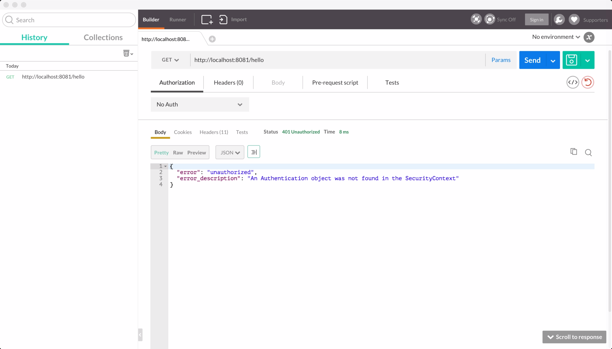
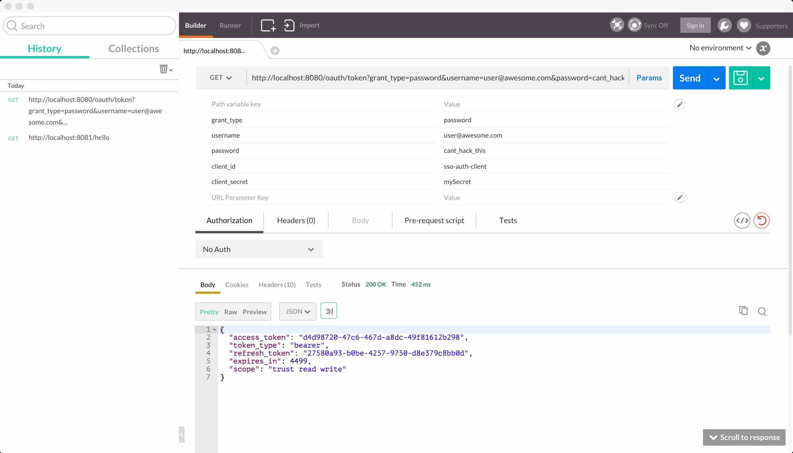
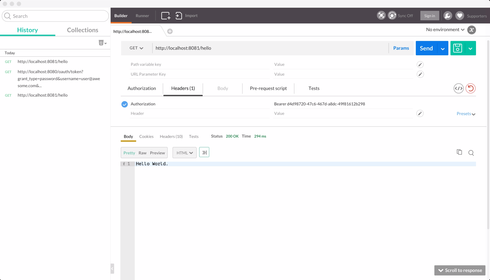

# sso-auth

From [Using Spring Security OAuth 2.0 and MongoDB For Single Sign Authentication Server](http://malike.github.io/Spring-Security-OAuth2/) I explained how I chose OAuth 2.0 and MongoDB to build a Single Sign On Auth server that can be used in a microservice architecture.

*1.* First step. Run sso-auth-client application. And try accessing [http://localhost:8081/hello](http://localhost:8081/hello). Without
passing any headers it returns this

*2.* Second step. Run sso-auth-server. Lets use the ***password*** **grant_type** to get an access token.
[http://localhost:8080/oauth/token?grant_type=password&username=user@awesome.com&password=cant_hack_this&client_id=sso-auth-client&client_secret=mySecret](http://localhost:8080/oauth/token?grant_type=password&username=user@awesome.com&password=cant_hack_this&client_id=sso-auth-client&client_secret=mySecret)

*3.* Final step. Lets access [http://localhost:8081/hello](http://localhost:8081/hello) with our access token.
And we are in.

.

